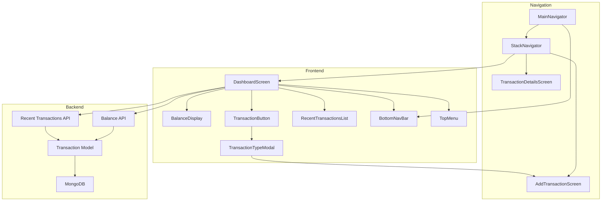

# Design Document

## Overview

This design document outlines the technical architecture and implementation details for the dashboard redesign feature. The redesign focuses on creating a simplified, balance-centric home screen with streamlined transaction recording and improved navigation. The implementation involves changes to the frontend UI components, navigation structure, backend API endpoints, and database queries.

## Architecture

### System Components



### Data Flow

1. **Dashboard Load**: User opens app → DashboardScreen mounts → Fetches balance and recent transactions → Displays data
2. **Add Transaction**: User taps center button → Modal shows Credit/Debit options → User selects type → Navigates to AddTransactionScreen with pre-selected type
3. **View Transaction**: User taps transaction item → Navigates to TransactionDetailsScreen with transaction ID
4. **Navigation**: User taps bottom nav item → Navigates to corresponding screen

## Components and Interfaces

### Frontend Components

#### 1. DashboardScreen (Redesigned)

**Location**: `frontend/app/screens/dashboard/DashboardScreen.tsx`

**Purpose**: Main landing screen displaying balance, transaction button, and recent transactions

**Props**: None (uses navigation prop from React Navigation)

**State**:
```typescript
interface DashboardState {
  balance: number;
  totalIncome: number;
  totalExpenses: number;
  recentTransactions: Transaction[];
  isLoading: boolean;
  isRefreshing: boolean;
  error: string | null;
  showTransactionModal: boolean;
}
```

**Key Methods**:
- `loadDashboardData()`: Fetches balance and recent transactions
- `handleRefresh()`: Pull-to-refresh handler
- `handleAddTransaction(type: 'income' | 'expense')`: Navigates to add transaction screen
- `handleTransactionPress(transactionId: string)`: Navigates to transaction details

**UI Structure**:
```
SafeAreaView
├── TopMenu (three-dot icon)
├── ScrollView (with pull-to-refresh)
│   ├── BalanceDisplay
│   ├── TransactionButton
│   └── RecentTransactionsList
└── BottomNavBar
```

#### 2. BalanceDisplay Component

**Location**: `frontend/app/components/dashboard/BalanceDisplay.tsx`

**Purpose**: Displays user's current balance with color coding

**Props**:
```typescript
interface BalanceDisplayProps {
  balance: number;
  totalIncome: number;
  totalExpenses: number;
  isLoading?: boolean;
}
```

**Styling**:
- Large, centered text for balance
- Green color for positive balance
- Red color for negative balance
- Neutral color for zero balance
- Smaller text below showing income and expenses breakdown

#### 3. TransactionButton Component

**Location**: `frontend/app/components/dashboard/TransactionButton.tsx`

**Purpose**: Central button that opens transaction type selection modal

**Props**:
```typescript
interface TransactionButtonProps {
  onPress: () => void;
}
```

**Features**:
- Large, prominent button centered on screen
- Opens modal with Credit/Debit options
- Animated press feedback

#### 4. TransactionTypeModal Component

**Location**: `frontend/app/components/dashboard/TransactionTypeModal.tsx`

**Purpose**: Modal displaying Credit and Debit options

**Props**:
```typescript
interface TransactionTypeModalProps {
  visible: boolean;
  onClose: () => void;
  onSelectType: (type: 'income' | 'expense') => void;
}
```

**UI**:
- Two large buttons: Credit (green) and Debit (red)
- Icons for each type
- Backdrop that closes modal when tapped

#### 5. RecentTransactionsList Component

**Location**: `frontend/app/components/dashboard/RecentTransactionsList.tsx`

**Purpose**: Displays list of 5 most recent transactions

**Props**:
```typescript
interface RecentTransactionsListProps {
  transactions: Transaction[];
  onTransactionPress: (transactionId: string) => void;
  isLoading?: boolean;
}
```

**Features**:
- Shows transaction type icon (up/down arrow)
- Displays category, date, and amount
- Color-coded amounts (green for income, red for expense)
- Empty state when no transactions exist
- Tap to view transaction details

#### 6. TopMenu Component

**Location**: `frontend/app/components/navigation/TopMenu.tsx`

**Purpose**: Three-dot menu in top-left corner for additional features

**Props**:
```typescript
interface TopMenuProps {
  navigation: any;
}
```

**Menu Items**:
- Settings
- Categories
- Budgets
- Recurring Payments
- Export Data
- Logout

#### 7. BottomNavBar Component

**Location**: `frontend/app/navigation/BottomTabNavigator.tsx`

**Purpose**: Bottom navigation bar for main app sections

**Tabs**:
- Home/Dashboard (home icon)
- Transactions (list icon)
- Analytics (chart icon)
- Profile (person icon)

### Backend API Endpoints

#### 1. Get User Balance

**Endpoint**: `GET /api/user/balance`

**Authentication**: Required (JWT token)

**Response**:
```json
{
  "success": true,
  "data": {
    "balance": 15000.50,
    "totalIncome": 50000.00,
    "totalExpenses": 34999.50
  }
}
```

**Implementation Location**: `backend/routes/users.js`

**Logic**:
1. Extract user ID from authenticated request
2. Query Transaction model for all user's income transactions
3. Query Transaction model for all user's expense transactions
4. Calculate totals using aggregation
5. Return balance (income - expenses) with breakdown

#### 2. Get Recent Transactions

**Endpoint**: `GET /api/transactions/recent`

**Authentication**: Required (JWT token)

**Query Parameters**:
- `limit` (optional, default: 5): Number of transactions to return

**Response**:
```json
{
  "success": true,
  "data": [
    {
      "_id": "507f1f77bcf86cd799439011",
      "type": "expense",
      "category": "Food",
      "amount": 250.00,
      "date": "2025-12-02T10:30:00Z",
      "paymentMode": "upi",
      "notes": "Lunch at restaurant"
    }
  ]
}
```

**Implementation Location**: `backend/routes/transactions.js`

**Logic**:
1. Extract user ID from authenticated request
2. Query Transaction model with userId filter
3. Sort by date descending
4. Limit results to specified number (default 5)
5. Return transaction array

### Frontend Services

#### DashboardService

**Location**: `frontend/app/services/DashboardService.ts`

**Purpose**: Service layer for dashboard-specific API calls

**Methods**:

```typescript
class DashboardService {
  // Get user balance
  static async getBalance(): Promise<{
    balance: number;
    totalIncome: number;
    totalExpenses: number;
  }>;
  
  // Get recent transactions
  static async getRecentTransactions(limit?: number): Promise<Transaction[]>;
  
  // Refresh all dashboard data
  static async refreshDashboard(): Promise<{
    balance: BalanceData;
    recentTransactions: Transaction[];
  }>;
}
```

### Navigation Structure

#### Updated Navigation Hierarchy

```
AppNavigator
└── MainNavigator (after authentication)
    ├── BottomTabNavigator
    │   ├── DashboardStack
    │   │   ├── DashboardScreen (default)
    │   │   ├── TransactionDetailsScreen
    │   │   └── AddTransactionScreen
    │   ├── TransactionsStack
    │   │   ├── TransactionsListScreen
    │   │   └── TransactionDetailsScreen
    │   ├── AnalyticsStack
    │   │   └── AnalyticsScreen
    │   └── ProfileStack
    │       └── ProfileScreen
    └── MenuNavigator (from TopMenu)
        ├── SettingsScreen
        ├── CategoriesScreen
        ├── BudgetsScreen
        └── RecurringPaymentsScreen
```

## Data Models

### Balance Data

```typescript
interface BalanceData {
  balance: number;
  totalIncome: number;
  totalExpenses: number;
}
```

### Transaction (Existing, for reference)

```typescript
interface Transaction {
  _id: string;
  userId: string;
  amount: number;
  category: string;
  type: 'income' | 'expense';
  paymentMode: 'cash' | 'upi' | 'card' | 'bank_transfer' | 'other';
  notes?: string;
  date: Date;
  createdAt: Date;
  updatedAt: Date;
}
```

## Error Handling

### Frontend Error Handling

1. **Network Errors**:
   - Display user-friendly error message
   - Provide retry button
   - Cache last successful data for offline viewing

2. **API Errors**:
   - Parse error response from backend
   - Display specific error message
   - Log error for debugging

3. **Loading States**:
   - Show skeleton loaders during initial load
   - Show pull-to-refresh indicator during refresh
   - Disable buttons during operations

### Backend Error Handling

1. **Authentication Errors**:
   - Return 401 Unauthorized if token is invalid
   - Return 403 Forbidden if user lacks permissions

2. **Database Errors**:
   - Catch and log database errors
   - Return 500 Internal Server Error with generic message
   - Don't expose database details to client

3. **Validation Errors**:
   - Return 400 Bad Request with validation details
   - Provide clear error messages for each field

### Error Response Format

```json
{
  "success": false,
  "error": "Error message here",
  "details": {
    "field": "Specific field error"
  }
}
```

## Testing Strategy

### Unit Tests

#### Frontend Components

1. **BalanceDisplay Component**:
   - Test positive balance renders in green
   - Test negative balance renders in red
   - Test zero balance renders in neutral color
   - Test loading state displays skeleton
   - Test number formatting

2. **TransactionButton Component**:
   - Test button press triggers modal
   - Test button animation
   - Test accessibility

3. **TransactionTypeModal Component**:
   - Test modal opens and closes
   - Test Credit button navigates with 'income' type
   - Test Debit button navigates with 'expense' type
   - Test backdrop closes modal

4. **RecentTransactionsList Component**:
   - Test renders transaction list correctly
   - Test empty state displays when no transactions
   - Test transaction press triggers navigation
   - Test loading state

5. **TopMenu Component**:
   - Test menu opens and closes
   - Test each menu item navigates correctly
   - Test logout functionality

#### Backend API Endpoints

1. **GET /api/user/balance**:
   - Test returns correct balance calculation
   - Test requires authentication
   - Test handles user with no transactions
   - Test handles database errors

2. **GET /api/transactions/recent**:
   - Test returns correct number of transactions
   - Test sorts by date descending
   - Test filters by user ID
   - Test respects limit parameter
   - Test requires authentication

#### Services

1. **DashboardService**:
   - Test getBalance() calls correct endpoint
   - Test getRecentTransactions() calls correct endpoint
   - Test refreshDashboard() calls both endpoints
   - Test error handling
   - Test caching behavior

### Integration Tests

1. **Dashboard Load Flow**:
   - Test complete dashboard load from mount to data display
   - Test handles API failures gracefully
   - Test refresh functionality

2. **Add Transaction Flow**:
   - Test navigation from dashboard to add transaction
   - Test type pre-selection works correctly
   - Test dashboard refreshes after adding transaction

3. **Navigation Flow**:
   - Test bottom nav switches between screens
   - Test top menu navigates to correct screens
   - Test back navigation works correctly

### End-to-End Tests

1. **User Journey: View Balance**:
   - Login → Dashboard loads → Balance displays correctly

2. **User Journey: Add Transaction**:
   - Dashboard → Tap center button → Select Credit → Fill form → Submit → Dashboard refreshes

3. **User Journey: View Transaction Details**:
   - Dashboard → Tap recent transaction → Details screen opens

## Performance Considerations

### Frontend Optimization

1. **Lazy Loading**:
   - Lazy load transaction details screen
   - Lazy load menu screens

2. **Memoization**:
   - Memoize balance display component
   - Memoize transaction list items
   - Use React.memo for pure components

3. **Caching**:
   - Cache balance data for 1 minute
   - Cache recent transactions for 30 seconds
   - Implement stale-while-revalidate pattern

4. **Animations**:
   - Use native driver for animations
   - Optimize modal transitions
   - Debounce button presses

### Backend Optimization

1. **Database Queries**:
   - Use aggregation pipeline for balance calculation
   - Add indexes on userId and date fields
   - Limit query results appropriately

2. **Caching**:
   - Consider Redis caching for frequently accessed data
   - Cache balance calculations for short periods
   - Invalidate cache on transaction create/update/delete

3. **Response Size**:
   - Only return necessary fields in recent transactions
   - Use projection in MongoDB queries
   - Compress responses

## Security Considerations

1. **Authentication**:
   - All endpoints require valid JWT token
   - Verify user ID from token matches requested data

2. **Authorization**:
   - Users can only access their own balance
   - Users can only see their own transactions

3. **Input Validation**:
   - Validate limit parameter in recent transactions endpoint
   - Sanitize all user inputs
   - Prevent SQL/NoSQL injection

4. **Rate Limiting**:
   - Implement rate limiting on API endpoints
   - Prevent abuse of balance endpoint

## Accessibility

1. **Screen Reader Support**:
   - Add accessibility labels to all interactive elements
   - Provide meaningful descriptions for balance and transactions
   - Announce loading and error states

2. **Touch Targets**:
   - Ensure all buttons meet minimum 44x44 point size
   - Provide adequate spacing between interactive elements

3. **Color Contrast**:
   - Ensure text meets WCAG AA standards
   - Don't rely solely on color to convey information
   - Provide alternative indicators (icons, text)

4. **Keyboard Navigation**:
   - Support tab navigation on web
   - Ensure focus indicators are visible

## Migration Strategy

### Phase 1: Backend API Development
1. Create balance endpoint in users.js
2. Create recent transactions endpoint in transactions.js
3. Add database indexes
4. Write unit tests for endpoints

### Phase 2: Frontend Component Development
5. Create new dashboard components
6. Create DashboardService
7. Write component unit tests

### Phase 3: Navigation Updates
8. Update navigation structure
9. Add bottom tab navigator
10. Add top menu component
11. Test navigation flows

### Phase 4: Integration
12. Connect dashboard screen to new APIs
13. Test complete user flows
14. Fix bugs and optimize performance

### Phase 5: Deployment
15. Deploy backend changes
16. Deploy frontend changes
17. Monitor for errors
18. Gather user feedback

## Rollback Plan

If issues arise after deployment:

1. **Backend Rollback**:
   - Revert to previous API version
   - Keep new endpoints but disable them
   - Monitor database performance

2. **Frontend Rollback**:
   - Revert to previous dashboard implementation
   - Keep new components but don't use them
   - Restore old navigation structure

3. **Data Integrity**:
   - No database schema changes, so no data migration needed
   - All existing data remains compatible
