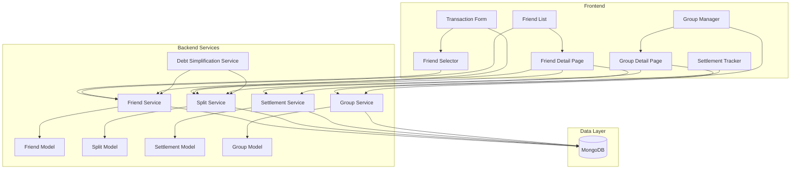

# Design Document: Friend & Expense Splitting System

## Overview

This design document outlines the architecture for a comprehensive friend and expense splitting system integrated into the existing budget tracker application. The system enables users to manage friendships, split expenses in multiple ways, simplify debts using algorithms, create groups, and track settlements. The design follows a modular approach with clear separation of concerns between backend services and frontend components.

### Key Design Principles

1. **Backward Compatibility**: Extend existing Transaction model without breaking current functionality
2. **Data Integrity**: Ensure all splits are mathematically accurate and validated
3. **Performance**: Optimize queries for friend lists, balances, and group calculations
4. **Scalability**: Design for efficient debt simplification even with many users
5. **User Experience**: Auto-populate friend details and provide real-time balance updates

## Architecture

### System Components



### Technology Stack

- **Backend**: Node.js with Express.js
- **Database**: MongoDB with Mongoose ODM
- **Frontend**: React Native with TypeScript
- **Authentication**: JWT-based (existing system)
- **Real-time Updates**: REST API with polling (future: WebSocket support)

## Components and Interfaces

### Backend Models

#### 1. Friendship Model

```javascript
const friendshipSchema = new mongoose.Schema({
  requester: {
    type: mongoose.Schema.Types.ObjectId,
    ref: 'User',
    required: true,
    index: true
  },
  recipient: {
    type: mongoose.Schema.Types.ObjectId,
    ref: 'User',
    required: true,
    index: true
  },
  status: {
    type: String,
    enum: ['pending', 'accepted', 'declined', 'blocked', 'archived'],
    default: 'pending',
    index: true
  },
  requestedAt: {
    type: Date,
    default: Date.now
  },
  respondedAt: Date,
  archivedAt: Date,
  // Cached balance for performance (updated on transaction/settlement)
  balance: {
    amount: {
      type: Number,
      default: 0
    },
    // Positive: requester owes recipient, Negative: recipient owes requester
    direction: {
      type: String,
      enum: ['requester_owes', 'recipient_owes', 'settled'],
      default: 'settled'
    },
    lastUpdated: Date
  }
}, {
  timestamps: true
});

// Compound indexes
friendshipSchema.index({ requester: 1, recipient: 1 }, { unique: true });
friendshipSchema.index({ requester: 1, status: 1 });
friendshipSchema.index({ recipient: 1, status: 1 });
```

#### 2. Extended Transaction Model

```javascript
// Add to existing Transaction schema
const splitInfoSchema = new mongoose.Schema({
  isShared: {
    type: Boolean,
    default: false,
    index: true
  },
  paidBy: {
    type: mongoose.Schema.Types.ObjectId,
    ref: 'User',
    required: function() { return this.isShared; }
  },
  splitType: {
    type: String,
    enum: ['equal', 'percentage', 'custom'],
    required: function() { return this.isShared; }
  },
  participants: [{
    user: {
      type: mongoose.Schema.Types.ObjectId,
      ref: 'User',
      required: true
    },
    share: {
      type: Number,
      required: true,
      min: 0
    },
    // For percentage splits
    percentage: {
      type: Number,
      min: 0,
      max: 100
    },
    settled: {
      type: Boolean,
      default: false
    },
    settledAt: Date
  }],
  groupId: {
    type: mongoose.Schema.Types.ObjectId,
    ref: 'Group'
  }
});

// Add to Transaction schema
transactionSchema.add({
  friendUid: {
    type: String,
    index: true,
    sparse: true
  },
  friendId: {
    type: mongoose.Schema.Types.ObjectId,
    ref: 'User',
    index: true,
    sparse: true
  },
  splitInfo: splitInfoSchema
});
```

#### 3. Settlement Model

```javascript
const settlementSchema = new mongoose.Schema({
  payer: {
    type: mongoose.Schema.Types.ObjectId,
    ref: 'User',
    required: true,
    index: true
  },
  recipient: {
    type: mongoose.Schema.Types.ObjectId,
    ref: 'User',
    required: true,
    index: true
  },
  amount: {
    type: Number,
    required: true,
    min: 0.01
  },
  paymentMethod: {
    type: String,
    enum: ['cash', 'upi', 'card', 'bank_transfer', 'other'],
    required: true
  },
  notes: {
    type: String,
    maxlength: 500
  },
  status: {
    type: String,
    enum: ['pending', 'confirmed', 'disputed'],
    default: 'pending',
    index: true
  },
  date: {
    type: Date,
    default: Date.now,
    index: true
  },
  confirmedAt: Date,
  confirmedBy: {
    type: mongoose.Schema.Types.ObjectId,
    ref: 'User'
  },
  groupId: {
    type: mongoose.Schema.Types.ObjectId,
    ref: 'Group'
  },
  // Reference to transactions being settled
  relatedTransactions: [{
    type: mongoose.Schema.Types.ObjectId,
    ref: 'Transaction'
  }]
}, {
  timestamps: true
});

// Compound indexes
settlementSchema.index({ payer: 1, recipient: 1, date: -1 });
settlementSchema.index({ payer: 1, status: 1 });
settlementSchema.index({ recipient: 1, status: 1 });
```

#### 4. Group Model

```javascript
const groupSchema = new mongoose.Schema({
  name: {
    type: String,
    required: true,
    trim: true,
    maxlength: 100
  },
  type: {
    type: String,
    enum: ['trip', 'rent', 'office_lunch', 'custom'],
    default: 'custom'
  },
  description: {
    type: String,
    maxlength: 500
  },
  createdBy: {
    type: mongoose.Schema.Types.ObjectId,
    ref: 'User',
    required: true,
    index: true
  },
  members: [{
    user: {
      type: mongoose.Schema.Types.ObjectId,
      ref: 'User',
      required: true
    },
    role: {
      type: String,
      enum: ['admin', 'member'],
      default: 'member'
    },
    joinedAt: {
      type: Date,
      default: Date.now
    },
    leftAt: Date,
    isActive: {
      type: Boolean,
      default: true
    }
  }],
  // Cached balances for performance
  balances: [{
    user: {
      type: mongoose.Schema.Types.ObjectId,
      ref: 'User'
    },
    netBalance: {
      type: Number,
      default: 0
    },
    lastUpdated: Date
  }],
  totalExpenses: {
    type: Number,
    default: 0
  },
  isActive: {
    type: Boolean,
    default: true,
    index: true
  },
  isSettled: {
    type: Boolean,
    default: false,
    index: true
  },
  settledAt: Date
}, {
  timestamps: true
});

// Indexes
groupSchema.index({ createdBy: 1, isActive: 1 });
groupSchema.index({ 'members.user': 1, isActive: 1 });
```

### Backend Services

#### 1. Friend Service

**Responsibilities:**
- Manage friend requests (send, accept, decline)
- Search users by UID, email, or phone
- Calculate and cache friend balances
- Provide friend list with balance status

**Key Methods:**

```javascript
class FriendService {
  // Search users by UID, email, or phone
  async searchUsers(query, currentUserId)
  
  // Send friend request
  async sendFriendRequest(requesterId, recipientId)
  
  // Accept friend request
  async acceptFriendRequest(friendshipId, userId)
  
  // Decline friend request
  async declineFriendRequest(friendshipId, userId)
  
  // Get friend list with balances
  async getFriendList(userId, filters)
  
  // Get friend details
  async getFriendDetails(userId, friendId)
  
  // Calculate balance between two users
  async calculateBalance(userId1, userId2)
  
  // Update cached balance (called after transaction/settlement)
  async updateCachedBalance(userId1, userId2)
  
  // Remove friend (archive)
  async removeFriend(userId, friendId)
}
```

#### 2. Split Service

**Responsibilities:**
- Validate split configurations
- Calculate individual shares
- Create split records for transactions
- Update participant settlement status

**Key Methods:**

```javascript
class SplitService {
  // Validate split configuration
  validateSplit(amount, splitType, participants)
  
  // Calculate equal split
  calculateEqualSplit(amount, participantCount)
  
  // Calculate percentage split
  calculatePercentageSplit(amount, percentages)
  
  // Calculate custom split
  validateCustomSplit(amount, customAmounts)
  
  // Create split for transaction
  async createSplit(transactionId, splitConfig)
  
  // Update split
  async updateSplit(transactionId, splitConfig)
  
  // Mark participant as settled
  async markParticipantSettled(transactionId, userId)
  
  // Get user's share in transaction
  getUserShare(transaction, userId)
}
```

#### 3. Settlement Service

**Responsibilities:**
- Record settlement payments
- Confirm settlements
- Handle disputes
- Update balances after settlement

**Key Methods:**

```javascript
class SettlementService {
  // Create settlement
  async createSettlement(payerId, recipientId, amount, details)
  
  // Confirm settlement
  async confirmSettlement(settlementId, userId)
  
  // Dispute settlement
  async disputeSettlement(settlementId, userId, reason)
  
  // Get settlements between users
  async getSettlements(userId1, userId2, filters)
  
  // Get pending settlements for user
  async getPendingSettlements(userId)
  
  // Delete settlement
  async deleteSettlement(settlementId, userId)
  
  // Calculate settlement impact on balance
  calculateSettlementImpact(settlement)
}
```

#### 4. Group Service

**Responsibilities:**
- Create and manage groups
- Add/remove members
- Calculate group balances
- Simplify group debts

**Key Methods:**

```javascript
class GroupService {
  // Create group
  async createGroup(name, type, createdBy, members)
  
  // Add member to group
  async addMember(groupId, userId, addedBy)
  
  // Remove member from group
  async removeMember(groupId, userId, removedBy)
  
  // Get group details
  async getGroupDetails(groupId, userId)
  
  // Get user's groups
  async getUserGroups(userId, filters)
  
  // Calculate group balances
  async calculateGroupBalances(groupId)
  
  // Update cached group balances
  async updateGroupBalances(groupId)
  
  // Mark group as settled
  async markGroupSettled(groupId)
  
  // Get group expenses
  async getGroupExpenses(groupId, filters)
}
```

#### 5. Debt Simplification Service

**Responsibilities:**
- Implement greedy algorithm for debt simplification
- Calculate optimal settlement paths
- Provide simplified settlement suggestions

**Key Methods:**

```javascript
class DebtSimplificationService {
  // Simplify debts using greedy algorithm
  simplifyDebts(balances)
  
  // Calculate net balances for a group
  calculateNetBalances(transactions)
  
  // Get simplified settlement plan
  getSimplifiedSettlements(userId, friendIds)
  
  // Get group simplified settlements
  getGroupSimplifiedSettlements(groupId)
}
```

**Algorithm Overview:**

```javascript
// Greedy Debt Simplification Algorithm
function simplifyDebts(balances) {
  // balances: Map of userId -> net balance (positive = owed, negative = owes)
  
  const creditors = []; // Users who are owed money
  const debtors = [];   // Users who owe money
  const settlements = [];
  
  // Separate creditors and debtors
  for (const [userId, balance] of balances) {
    if (balance > 0) {
      creditors.push({ userId, amount: balance });
    } else if (balance < 0) {
      debtors.push({ userId, amount: Math.abs(balance) });
    }
  }
  
  // Sort by amount (descending)
  creditors.sort((a, b) => b.amount - a.amount);
  debtors.sort((a, b) => b.amount - a.amount);
  
  let i = 0, j = 0;
  
  // Match creditors with debtors
  while (i < creditors.length && j < debtors.length) {
    const creditor = creditors[i];
    const debtor = debtors[j];
    
    const settleAmount = Math.min(creditor.amount, debtor.amount);
    
    settlements.push({
      from: debtor.userId,
      to: creditor.userId,
      amount: settleAmount
    });
    
    creditor.amount -= settleAmount;
    debtor.amount -= settleAmount;
    
    if (creditor.amount === 0) i++;
    if (debtor.amount === 0) j++;
  }
  
  return settlements;
}
```

### Backend API Endpoints

#### Friend Management

```
POST   /api/friends/search              - Search users
POST   /api/friends/request             - Send friend request
POST   /api/friends/:id/accept          - Accept friend request
POST   /api/friends/:id/decline         - Decline friend request
GET    /api/friends                     - Get friend list
GET    /api/friends/:id                 - Get friend details
DELETE /api/friends/:id                 - Remove friend
GET    /api/friends/requests/pending    - Get pending requests
GET    /api/friends/:id/balance         - Get balance with friend
```

#### Split Management

```
POST   /api/transactions/:id/split      - Add split to transaction
PUT    /api/transactions/:id/split      - Update split
DELETE /api/transactions/:id/split      - Remove split
POST   /api/transactions/:id/split/settle/:userId - Mark participant settled
GET    /api/transactions/shared         - Get shared transactions
```

#### Settlement Management

```
POST   /api/settlements                 - Create settlement
GET    /api/settlements                 - Get settlements (with filters)
GET    /api/settlements/:id             - Get settlement details
POST   /api/settlements/:id/confirm     - Confirm settlement
POST   /api/settlements/:id/dispute     - Dispute settlement
DELETE /api/settlements/:id             - Delete settlement
GET    /api/settlements/pending         - Get pending settlements
```

#### Group Management

```
POST   /api/groups                      - Create group
GET    /api/groups                      - Get user's groups
GET    /api/groups/:id                  - Get group details
PUT    /api/groups/:id                  - Update group
DELETE /api/groups/:id                  - Delete group
POST   /api/groups/:id/members          - Add member
DELETE /api/groups/:id/members/:userId  - Remove member
GET    /api/groups/:id/expenses         - Get group expenses
GET    /api/groups/:id/balances         - Get group balances
POST   /api/groups/:id/settle           - Mark group as settled
GET    /api/groups/:id/simplify         - Get simplified settlements
```

#### Analytics

```
GET    /api/analytics/shared-expenses   - Get shared expense analytics
GET    /api/analytics/friends/:id       - Get friend expense analytics
GET    /api/analytics/groups/:id        - Get group analytics
```

### Frontend Components

#### 1. Friend Selector Component

**Purpose**: Auto-complete input for selecting friends in transaction form

**Props:**
```typescript
interface FriendSelectorProps {
  value: string;
  onSelect: (friend: Friend) => void;
  onUidChange: (uid: string) => void;
  placeholder?: string;
}
```

**Features:**
- Real-time search as user types UID
- Display friend details (name, picture, balance)
- Show "Add Friend" option for non-friends
- Debounced API calls for performance

#### 2. Split Configuration Component

**Purpose**: Configure how expense is split among participants

**Props:**
```typescript
interface SplitConfigProps {
  totalAmount: number;
  participants: Participant[];
  splitType: 'equal' | 'percentage' | 'custom';
  onSplitChange: (split: SplitConfig) => void;
}
```

**Features:**
- Toggle between split types
- Real-time validation
- Visual preview of each person's share
- Error messages for invalid splits

#### 3. Friend List Component

**Purpose**: Display list of friends with balance status

**Features:**
- Filter by balance status (owes you, you owe, settled)
- Search friends
- Sort by name or balance amount
- Visual indicators for balance direction
- Pull-to-refresh

#### 4. Friend Detail Page

**Purpose**: Show detailed view of relationship with a friend

**Sections:**
- Balance summary card
- Shared expenses list (filterable)
- Settlement history
- Quick settle button
- Expense breakdown by category

#### 5. Group Manager Component

**Purpose**: Create and manage expense groups

**Features:**
- Create new group with type selection
- Add/remove members
- View group balance summary
- Access group detail page

#### 6. Group Detail Page

**Purpose**: Manage group expenses and settlements

**Sections:**
- Group info and members
- Balance matrix (who owes whom)
- Group expenses list
- Simplified settlement suggestions
- Settlement history

#### 7. Settlement Form Component

**Purpose**: Record a settlement payment

**Props:**
```typescript
interface SettlementFormProps {
  friendId: string;
  suggestedAmount?: number;
  onSubmit: (settlement: SettlementData) => void;
}
```

**Features:**
- Amount input with suggested value
- Payment method selection
- Notes field
- Date picker
- Confirmation dialog

#### 8. Debt Simplification View

**Purpose**: Show simplified settlement suggestions

**Features:**
- Visual graph of current debts
- Simplified settlement plan
- Comparison (before/after transaction count)
- One-tap settlement creation

## Data Models

### TypeScript Interfaces (Frontend)

```typescript
interface Friend {
  _id: string;
  uid: string;
  name: string;
  email: string;
  profilePicture?: string;
  balance: {
    amount: number;
    direction: 'you_owe' | 'owes_you' | 'settled';
  };
  friendshipStatus: 'pending' | 'accepted';
  friendshipId: string;
}

interface SplitConfig {
  isShared: boolean;
  paidBy: string;
  splitType: 'equal' | 'percentage' | 'custom';
  participants: SplitParticipant[];
  groupId?: string;
}

interface SplitParticipant {
  user: string;
  share: number;
  percentage?: number;
  settled: boolean;
  settledAt?: Date;
}

interface Settlement {
  _id: string;
  payer: User;
  recipient: User;
  amount: number;
  paymentMethod: string;
  notes?: string;
  status: 'pending' | 'confirmed' | 'disputed';
  date: Date;
  confirmedAt?: Date;
  groupId?: string;
}

interface Group {
  _id: string;
  name: string;
  type: 'trip' | 'rent' | 'office_lunch' | 'custom';
  description?: string;
  createdBy: User;
  members: GroupMember[];
  balances: GroupBalance[];
  totalExpenses: number;
  isActive: boolean;
  isSettled: boolean;
}

interface GroupMember {
  user: User;
  role: 'admin' | 'member';
  joinedAt: Date;
  isActive: boolean;
}

interface GroupBalance {
  user: User;
  netBalance: number;
  lastUpdated: Date;
}

interface SimplifiedSettlement {
  from: User;
  to: User;
  amount: number;
}
```

## Error Handling

### Validation Errors

1. **Split Validation**
   - Ensure split amounts sum to transaction total
   - Validate percentages sum to 100%
   - Check all participants are valid users

2. **Friend Request Validation**
   - Prevent duplicate friend requests
   - Validate user exists
   - Check not already friends

3. **Settlement Validation**
   - Ensure amount is positive
   - Validate payer and recipient are different
   - Check users are friends

### Business Logic Errors

1. **Insufficient Balance**: When trying to settle more than owed
2. **Unauthorized Access**: Accessing another user's friend data
3. **Group Member Removal**: Preventing removal with unsettled balance
4. **Transaction Modification**: Requiring all participants' consent

### Error Response Format

```javascript
{
  success: false,
  error: {
    code: 'SPLIT_VALIDATION_ERROR',
    message: 'Split amounts must sum to transaction total',
    details: {
      expected: 1000,
      actual: 950,
      difference: 50
    }
  }
}
```

## Testing Strategy

### Unit Tests

1. **Split Service Tests**
   - Test equal split calculation
   - Test percentage split calculation
   - Test custom split validation
   - Test edge cases (rounding, zero amounts)

2. **Debt Simplification Tests**
   - Test greedy algorithm correctness
   - Test with various balance configurations
   - Test edge cases (all settled, circular debts)

3. **Balance Calculation Tests**
   - Test balance updates after transactions
   - Test balance updates after settlements
   - Test cached balance accuracy

### Integration Tests

1. **Friend Workflow**
   - Send request → Accept → Add shared expense → Settle
   - Test balance updates throughout workflow

2. **Group Workflow**
   - Create group → Add members → Add expenses → Simplify → Settle

3. **Transaction Split Workflow**
   - Create transaction → Add split → Update split → Settle participants

### End-to-End Tests

1. **Complete Friend Expense Flow**
   - User A adds friend B
   - User A creates shared expense
   - User B views and confirms
   - User B records settlement
   - User A confirms settlement
   - Verify balances are correct

2. **Group Expense Flow**
   - Create group with 3 members
   - Add multiple expenses with different splits
   - View simplified settlements
   - Record settlements
   - Verify group is settled

### Performance Tests

1. **Balance Calculation Performance**
   - Test with 100+ transactions between users
   - Measure query time for friend list with balances

2. **Debt Simplification Performance**
   - Test with groups of 10, 50, 100 members
   - Measure algorithm execution time

3. **Caching Effectiveness**
   - Verify cached balances reduce query load
   - Test cache invalidation on updates

## Security Considerations

### Authentication & Authorization

1. **Friend Access Control**
   - Users can only view friends they're connected with
   - Validate friendship exists before showing shared data

2. **Transaction Modification**
   - Only transaction creator can modify split initially
   - Require participant consent for changes after creation

3. **Settlement Confirmation**
   - Only recipient can confirm settlement
   - Prevent self-confirmation

### Data Privacy

1. **User Search**
   - Limit search results to prevent data scraping
   - Rate limit search API

2. **Balance Information**
   - Only show balances to involved parties
   - Don't expose other users' financial data

### Input Validation

1. **Amount Validation**
   - Prevent negative amounts
   - Limit maximum transaction size
   - Validate decimal precision

2. **Split Validation**
   - Prevent manipulation of split calculations
   - Server-side validation of all splits

## Performance Optimization

### Database Optimization

1. **Indexes**
   - Compound indexes on userId + friendId
   - Index on transaction splitInfo.isShared
   - Index on settlement status and dates

2. **Caching Strategy**
   - Cache friend balances (update on transaction/settlement)
   - Cache group balances (update on group expense)
   - Use Redis for frequently accessed data (future enhancement)

3. **Query Optimization**
   - Use aggregation pipelines for balance calculations
   - Limit populated fields to necessary data
   - Implement pagination for large lists

### Frontend Optimization

1. **Lazy Loading**
   - Load friend list in batches
   - Infinite scroll for transaction lists

2. **Debouncing**
   - Debounce friend search input
   - Debounce split amount calculations

3. **Optimistic Updates**
   - Update UI immediately on actions
   - Rollback on server error

## Migration Strategy

### Phase 1: Database Schema Updates

1. Add splitInfo to Transaction model
2. Create Friendship, Settlement, and Group models
3. Add indexes for performance

### Phase 2: Backend API Development

1. Implement Friend Service and routes
2. Implement Split Service and routes
3. Implement Settlement Service and routes
4. Implement Group Service and routes
5. Implement Debt Simplification Service

### Phase 3: Frontend Development

1. Create Friend Selector component
2. Update Transaction Form with split options
3. Create Friend List and Detail pages
4. Create Group Manager and Detail pages
5. Create Settlement components

### Phase 4: Testing & Refinement

1. Unit and integration testing
2. User acceptance testing
3. Performance optimization
4. Bug fixes and refinements

### Phase 5: Deployment

1. Database migration scripts
2. Gradual rollout to users
3. Monitor performance and errors
4. Gather user feedback

## Future Enhancements

1. **Real-time Updates**: WebSocket support for live balance updates
2. **Multi-currency Support**: Handle splits in different currencies
3. **Recurring Group Expenses**: Auto-split recurring bills
4. **Expense Categories for Groups**: Track group spending by category
5. **Export & Reports**: Generate PDF reports for group expenses
6. **Payment Integration**: Direct payment through UPI/payment gateways
7. **Expense Approval Workflow**: Require approval before adding to split
8. **Smart Suggestions**: ML-based split suggestions based on history
